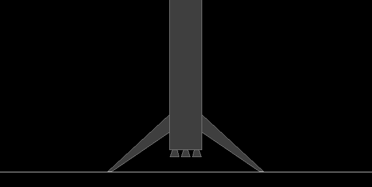

# **RocketLander** ✨🚀✨


# Introduction

*RocketLander* is a comprehensive framework equipped with optimization algorithms, such as reinforcement learning, evolution strategies, genetic optimization, and simulated annealing, to enable an orbital rocket booster to land autonomously. *RocketLander* is designed to be simple to use and can be easily extended. 

<p align="center">
    
</p>

The framework uses [*PyBox2D*](https://box2d.org/) a 2D physics library for rigid physics simulations, and [*PyGame*](https://www.pygame.org/) for rendering and visualization. 

I tried to make the simulation relatively realistic, even though that may conflict with [Box2D's recommendation](https://box2d.org/documentation/index.html#autotoc_md17) on object sizes. The booster has a height of about $46$ meters, a weight of about $25$ metric tons, and is made up of three parts. A long and low-density hull section containing mostly empty fuel tanks, a short but high-density engine section, and static medium-density landing legs.

In this framework, a booster is considered an agent that is equipped with a neural network (the agent's "brain") to learn how to propulsively land itself. The network is trained using reinforcement learning, evolution strategies, genetic optimization, or simulated annealing.

The neural network controls the actions of the booster. At each time step, the network receives the current state of the booster, which includes its position $r_x$ and $r_y$, velocity $v_x$ and $v_y$, angle $\theta$, and angular velocity $\omega$, as input. Based on this information, the network predicts an action, such as the levels of thrust and engine deflection.


# Installation

To run *RocketLander*, install the latest master directly from GitHub. For a basic install, run:

```console
git clone https://github.com/kaifishr/RocketLander
cd RocketLander 
pip3 install -r requirements.txt
```


# Getting Started

To start a training session using a specified learning method, run one of the examples in the project folder. For example:

```console
cd rocketlander
python -m projects.reinforcement_learning.main
python -m projects.evolution_strategies.main
python -m projects.genetic_optimization.main
python -m projects.simulated_annealing.main
```

Rendering and visualization can be turned off to greatly accelerate the optimization process by clicking on the PyGame window or by pressing `SPACEBAR`. Pressing `P` pauses the optimization process.

Track important metrics such as the reward with Tensorboard:

```console
cd rocketlander
tensorboard --logdir runs/
```


# Methods

## Notation

In this project, the terms *booster*, *agent*, *individual*, and *candidate* are used interchangeably. Similarly, the terms *epoch* and *episode* are also used interchangeably. In the context of genetic optimization the terms *fitness* and *reward* are considered the same thing.


## Reward Function

Independent of the optimization method the same reward function is used to measure the success of the agent during each episode. The reward function receives the booster's current position and velocity as input and outputs a scalar value. A simple reward function for landing a rocket booster can be designed as follows. 

To encourage the booster to land as close as possible to the center of the landing pad, we can assign a high reward for proximity. For example, we can assign a reward of $1$ for a landing at the center of the landing pad, and reduce the reward to $0$ as the distance between the booster and the landing pad increases. 

For the distance from booster to landing pad $d = \sqrt{(r_{x, \text{pad}} - r_{x, \text{booster}})^2 + (r_{y, \text{pad}} - r_{y, \text{booster}})^2}$, this can be formulated as follows:

$$R_{\text{proximity}} = \frac{1}{1 + \alpha d}$$

with the $x$- and $y$-coordinates of the landing pad and the booster. To avoid a rapid unscheduled disassembly of the booster, there is also a term that takes the booster's velocity into account,

$$R_{\text{velocity}} = \frac{R_{\text{proximity}}}{1 + \beta\sqrt{v_\text{x}^2 - v_\text{y}^2}}$$

with the $x$- and $y$-components of the booster's velocity. The reward is coupled with the booster's distance to the landing pad to encourage a soft landing. The hyperparameters, $\alpha$ and $\beta$, allow us to emphasize the rewards coming from proximity or velocity. 

Combining both terms, we obtain a reward function that encourages a soft landing at the center of the landing pad:

$$R = R_{\text{proximity}} + R_{\text{velocity}}$$

The agent also receives a large positive reward for a successful landing. On the other hand, if the vehicle exceeds a certain stress levels, experienced an impact, or left the domain, the agent receives a negative reward.

We can implicitly model a fuel restriction by lowering the number of simulation steps. This time restriction resembles an implicit fuel restriction, encouraging the booster to land more quickly.


## Asynchronous Reinforcement Learning

Reinforcement Learning is without a doubt one of the most interesting subfields of machine learning in which an agent (here the booster) learns to make decisions in an environment by interacting with it and receiving rewards for its actions.

In reinforcement learning, the goal of the agent is to learn a policy, represented by the booster's neural network, that maximizes a reward over time. The neural network maps the booster's state to pairs of actions and Q-values, which the agent uses to determine the best action to take in a given situation. This is typically done by trial and error, with the agent learning from its mistakes and adjusting its policy-based actions over time to improve its performance. 


### Asynchronous Deep Q-Learning

For this project I used asynchronous [Deep Q-learning](https://en.wikipedia.org/wiki/Q-learning) which is one of the core concepts in reinforcement learning. The implemented deep Q-learning algorithm uses a batch of episodes recorded by multiple boosters in parallel to learn a policy that maximizes the reward.

For the training of the agent we proceed as follows. We start by initializing our policy (the neural network) randomly. To ensure the agent explores its environment, we inject noise into its action space. That means, we either choose a random action from our discrete action space, or we take the action with the highest predicted utility predicted by the policy neural network at a given state As an aside, this is different from evolutionary strategies presented above, where we inject noise directly into the parameter space of the agent. Aside end. 

As the agent interacts with the environment, we record its state, action, and the reward received at each time step. We can then use backpropagation to encourage state-action pairs that result in positive or high rewards and discourage those with negative or low rewards. 


### Action Space

Q-learning is a type of reinforcement learning algorithm that is typically used in situations where the action space is discrete. This means that the possible actions that can be taken in a given situation are finite and distinct, rather than continuous or infinitely variable. 

When applying Q-learning to the problem of landing a booster, we need to discretize the action space and represent it as a lookup table from which the agent can choose an action. For example, if the main engine operates at two thrust levels and our booster can be fired at three different angles $\{-15°, 0°, 15°\}$, the discrete action space for the booster would consist of six possible actions, as shown below:

|#|Thrust level | Angle|
|:---:|:---:|:---:|
|1|50% | -15°|
|2|50% | -0°|
|3|50% | 15°|
|4|100% | -15°|
|5|100% | 0°|
|6|100% | 15°|

However, when dealing with engines that can operate at multiple levels of thrust and deflection angles (such as main engines and cold gas thrusters), discretizing the action space can make learning inefficient. This is due to the curse of dimensionality, which is a phenomenon that occurs when the number of dimensions in a problem grows exponentially, making it difficult to find good solutions.


## Evolution Strategies

Evolution strategies is a class of black-box stochastic optimization techniques that have achieved impressive results on reinforcement learning benchmarks. Despite their name, evolution strategies optimization has very little in common with genetic optimization. At its core, the evolution strategies optimization algorithm resembles simple hill-climbing in a high-dimensional space. It samples a population of candidate solutions and allows agents with high rewards to have a greater influence on the distribution of future generations.

Despite the simplicity, the evolution strategies algorithm is pretty powerful and overcomes many of reinforcement learning inconveniences. Optimization with evolution strategies is highly parallelizable, makes no assumptions about the underlying model to train, allows interactions between agents by default, and is not restricted to a discrete action space.

For the evolution strategies algorithm to work we only have to look at the parameterized reward function $R( \mathbf{s}; \mathbf{\theta} )$, that takes a state vector and outputs a scalar reward. During the optimization process, we estimate gradients that allow us to steer the parameters $\mathbf{\theta}$ into a direction to maximize the reward $R$. Thus, we are optimizing $R$ with respect to $\mathbf{\theta}$.

The evolution strategies algorithm generates at each time step a population of different parameter configurations $\mathbf{\theta}_i$ (the agents' neural network weights) from the base parameters $\mathbf{\theta}$ by adding gaussian noise ( $\mathbf{\theta}_i = \mathbf{\theta} + \mathbf{\epsilon}$ with $\mathbf{\epsilon} \sim \mathcal{N}(0, \sigma^2)$ and $i \in [1, N]$ ). After each agent has spend one episode in the environment a weighted sum over each agents policy network's parameters and gained reward is being created. This weighted sum of parameter vectors becomes the new base parameters. 

Mathematically, evolution strategies uses finite differences along a few random directions at each optimization step to estimate the gradients of the reward function $R$ with respect to the parameter vector $\mathbf{\theta}$. The estimated gradient is then used to update the policy network's parameters in a direction that increases the reward. This process is repeated until the desired level of performance is reached.


## Genetic Optimization

Inspired by evolution, genetic optimization uses a population of individuals that are slightly different from each other. These differences result from mutation, which is a fundamental property of evolution, and result in different behaviors in each agent. The difference in behavior makes some agents more successful than others. The fitness or success of an agent is represented by the fitness or reward function.

The algorithm begins with a population of candidate solutions, from which the agent with the highest fitness level advances to the next round. After selection, the fittest individual propagates its genetic traits to the next generation, with random mutations. This process is repeated until the desired fitness level is reached.

Here, we use the mutation operation during the optimization process to learn to land a rocket booster. Mutation operations act on all members of a population. The mutation operation is defined by the probability with which a parameter mutation is going to happen and the rate or strength with which the mutation acts on the parameter.


## Asynchronous Simulated Annealing

In 1983, Kirkpatrick et al., combined the insights of heating and cooling materials to change their physical properties with the Monte Carlo-based Metropolis-Hastings algorithm, to find approximate solutions to the traveling salesman problem. This combination led to the technique of simulated annealing. It has been shown, that with a sufficiently high initial temperature and sufficiently long cooling time, the system's minimum-energy state is reached.

In a nutshell, simulated annealing selects at each iteration a randomly created candidate solution that is close to the current one under some distance metric. The system moves to the proposed solution either if it comes with a higher reward or with a temperature-dependent probability. With decreasing temperature, the temperature-dependent probability to accept worse solutions narrows and the optimization focuses more and more on improving solutions approaching a Monte Carlo algorithm behavior.

In a previous project called [*NeuralAnnealing*](https://github.com/kaifishr/NeuralAnnealing), I implemented simulated annealing with [JAX](https://jax.readthedocs.io/en/latest/) to optimize neural networks for a classification task. I had good results with this approach, so I thought I would try using it here.


# TODOs

- Add explicit fuel constraint.
- Add dynamic landing legs.


# References

Salimans et al., 2017, [*Evolution Strategies as a Scalable Alternative to Reinforcement Learning*](https://arxiv.org/abs/1703.03864)

Yaghmaie et al., 2021, [*A Crash Course on Reinforcement Learning*](https://arxiv.org/abs/2103.04910)

[Box2D](https://box2d.org/) website

[Box2D C++](https://box2d.org/documentation/) documentation

[PyBox2D](https://github.com/pybox2d/pybox2d) on Github

[Backends](https://github.com/pybox2d/pybox2d/tree/master/library/Box2D/examples/backends) for PyBox2D

PyBox2D [tutorial](https://github.com/pybox2d/cython-box2d/blob/master/docs/source/getting_started.md)

[Minimal PyBox2D examples](https://github.com/pybox2d/pybox2d/tree/master/library/Box2D/examples)


# Citation

If you find this project useful, please use BibTeX to cite it as:

```bibtex
@article{fischer2022rocketlander,
  title   = "RocketLander",
  author  = "Fischer, Kai",
  journal = "GitHub repository",
  year    = "2022",
  month   = "December",
  url     = "https://github.com/kaifishr/RocketLander"
}
```


# License

MIT